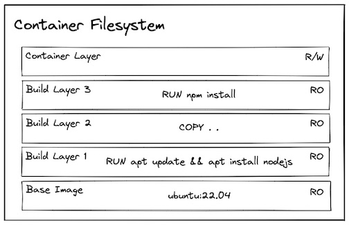
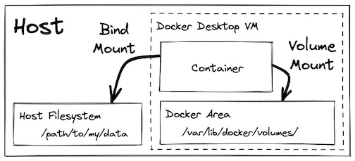

# LearnDocker

###################################################################################################
### Docker Step-by-Step Guide
### Creator – Pratik Kishor Munot
### Email id – pmunot11@gmail.com / pmunot@slb.com
### Version – 1.1
### Readme – This document is created by Pratik Munot for basic understanding of Docker Theory
### Last Updated – 9th April, 2022

##################################################################################################

-----------------------------------------------
# DOCKER  General Commands 

### Docker version 
```
docker -v
docker version 
```
-----------------------------------------------
### Docker info and Docker Login
```
docker info              # Display Docker and system info
docker login            # Login to Docker Registry
```
-----------------------------------------------
# DOCKER  Image

### List all available images on your system
```
docker images
docker image ls
```
-----------------------------------------------
### Display image info
```
docker image inspect <image-name>    OR # docker image inspect <image-id>
```

-----------------------------------------------
### Deleting an image
Use docker images to list all the available images on your system and gather the image name or image id to delete it
Delete the image with either name or id as follows
``` 
docker image rm -f 3101bd10ae78
docker rmi [imagename]
```
-----------------------------------------------
Remove all images not in use by any container
```
docker system prune -a
```
-----------------------------------------------
### Pulling an Image from Docker Hub/Registry

Go to https://hub.docker.com/
Search the desired image name in search box (/Nginx)
Copy docker pull cmd 
Execute the cmd in terminal/cmdprompt
OR 
If you already know image name or id use pull cmd as follow
```
docker pull <image-name>
```
To verify if image is downloaded run cmd - 
```
docker images or docker image ls
```
-----------------------------------------------

### Tag an existing image
```
docker tag <image name> <name:tag>
```
-----------------------------------------------

### Adding Tags / Tagging our containers
We can tag our containers in following way
```
docker tag website:latest website-fixed:1.1.11

website:latest – old tag
website-fixed:1.1.11 – new tag
C:\Users\pmunot\Desktop\Docker\user-service-api>docker image ls
REPOSITORY      TAG          IMAGE ID       CREATED        SIZE
website         latest       cdb289c5f79e   47 hours ago   153MB
website-fixed   1.1.11       cdb289c5f79e   47 hours ago   153MB
```
-----------------------------------------------

# DOCKER  Container

### List all running containers
```
docker ps 
docker container ls 
```
-----------------------------------------------
### List all running and stopped containers both
```
docker ps -a       # Display all container which are in running and stopped state both
docker ps -qa     # Display only container id for running and stopped containers
```
-----------------------------------------------
### Run a container
```
docker run <imgname>:<tag>
docker run nginx:latest

1) docker: It is docker engine and used to run docker program. It tells the operating system that you are running docker program.
2) run: This subcommand is used to create and run a docker container.
3) hello-world: It is a name of an image. You need to specify the name of an image which is to load into the container.
```

Running a simple container from a remote docker hub repo
```
root@azrprdapp01:~# docker run docker/whalesay cowsay "Hey Pratik! 👋"
 __________________
< Hey Pratik! 👋 >
 ------------------
    \
     \
      \
                    ##        .
              ## ## ##       ==
           ## ## ## ##      ===
       /""""""""""""""""___/ ===
  ~~~ {~~ ~~~~ ~~~ ~~~~ ~~ ~ /  ===- ~~~
       \______ o          __/
        \    \        __/
          \____\______/
root@azrprdapp01:~#

```
-----------------------------------------------

### Run a container (in detached mode)
When we run a container with docker run image:tag cmd – this will run the container in foreground as a live working process and we ont be able to use the terminal anymore unless we press Ctrl+C to terminate it. Running a container in detached mode will allow us to run the container in background. 
```
docker run -d nginx:latest
```

-----------------------------------------------

### Run an image and set cpu or memory limits
```
docker run –memory=”256m” <imgname>:<tag>
docker run –cpu=”0.5” nginx:latest
```
-----------------------------------------------
### Start a container
To start the same old container or a stopped container for which we have container name or id - run this cmd
```
docker start <container-id>   OR    # docker start <container-name>
```
-----------------------------------------------

### Stop a container
To stop the container run cmd
```
docker stop <container-id>    OR    # docker stop <container-name>
```
-----------------------------------------------
### Kill a container
To Kill the container run cmd
```
docker kill <container-id>    OR     # docker kill <container-name>
```
-----------------------------------------------
### Deleting/Removing a Container

docker rm will delete only stopped containers and giver error if we try to delete running container but docker rm -f will delete stopped and running containers as well
```
docker rm <container-name>        # Delete stopped container
docker rm -f <container-id>          # Delete stopped or running container both
docker rm -f <container-name>
```
-----------------------------------------------
### Naming a container
We can name our container with arg --name  
```
docker run –name myapp <image name>
docker run --name myapp -d -p 8080:80 nginx:latest
```
-----------------------------------------------
### Deleting all Containers in one single go

We can display list of ids of all containers with 
```
docker ps -aq 
and then pass these ids to rm cmd as
docker rm $(docker ps -aq)
```

### Exposing a Port of container
We have a container which can run nginx. This container is exposing a tcp port 80. We want to issue a request from our localhost to the container on port 80 ie. from our localhost we want to connect to port 80 of container. We can do this by adding argument -p 8080:80 in docker run cmd. This means port 8080 from the host should be mapped to port 80 of the container. -p stands for publish and can also be written as # docker run -d -publish 8080:80 <container-name>
```
docker run -d -p 8080:80 nginx:latest
```
 

### Exposing Multiple Ports 
We can map multiple ports of our system to any port of a container. Simply add -p argument
```
docker run -d -p 8080:80 -p 3000:80 nginx:latest

``` 


### Creating / Building our own custom image

We can create our own image by creating a file called as Dockerfile. 
Dockerfile is text file listing the steps to build an image.

Note: Images should contain everything that your application needs to run
Image is a template to create environment of our choice. It can contain – OS, snapshot, software, App code etc.
Whenever we build image we are not going to build image from scratch, we use FROM keyword to import things from base image.
We create a file in our base folder named as Dockerfile and edit it as following
```
FROM nginx:latest
ADD . /usr/share/nginx/html
OR
FROM nginx:alpine
COPY . /usr/share/nginx/html

```

nginx:latest is the base image that we specify to use.
COPY will copy the static content or files from current location(. Specifies ) /usr/share/nginx/html is the destination folder inside the container where all the static content goes from current location in host machine
 

### Docker build
```
docker build -t [website-name:tag] .           # Builds an image using a docker file located in same folder
docker build -t [name:tag] -f [filename]           # Builds an image using a docker file located in different location

```

We have created the Dockerfile and placed it in out base folder named as website. All other files are also present in website folder.
Now we cd to website folder and run docker build cmd to build our image

```
docker build -t [website:tag] .                      

```
we are adding tag to our image and the . (dot) at the end specifies the location of Dockerfile and since we are in exact same directory so we can put . as location

to check if image is created use cmd – docker image ls 
To run our custom built tage use cmd
```
C:\Users\pmunot\Desktop\Docker\website>docker run --name webpage -p 8080:80 -d website:latest
```


### Attach Shell to a container / Interactive mode 
A container at its base is nothing but a small linux image. We can enter inside our container ie work in interactive mode 

```
# docker run -it nginx -- /bin/bash          # run a new container with nginx image and attach bash shell
# docker run -it -- microsoft/powershell:nanoserverpwsh.exe   # attach powershell to container

# docker container exec -it <container-name>  -- bash      # attach shell to a running container
# docker exec -it myapp bash                # attach shell to a running container
root@74952fa5817e:/# cd /home
root@74952fa5817e:/home#

```


### Important Note on Containers
When we execute docker run command to start a container from an image – a new container is created. Now if we stop the container with docker stop it is stopped but not deleted. Now we have 2 options if we want to run the container of that image. 
<br>Option 1 – We can again use docker run cmd to start a container for that image
<br>Option 2 – We can use docker start cmd to start an existing container if we have container id/name
<br>In option 1 the docker run cmd will create new container everytime and in option 2 we are not creating new containers, instead we are just restarting the old or an existing container.
Whenever we use option 1 to run a container it creates a new container and then we use stop cmd to stop the container but that container is just stopped and its not deleted yet. So in future if we wish to start the same old existing container then we can use docker start cmd with container id or name.
Docker ps cmd will list down all the running or live containers but if we wish to see all containers which are running as well as which are stopped or in exited state then use following cmd

```
# docker ps -a
# docker ps -qa       # displays list of ids of all the containers

```

### Formatting a container output
We can format the normal output of docker ps cmd and display things which we want with cmd  
```
# docker ps --format="ID\t{{.ID}}\nNAME\t{{.Names}}\nIMAGE\t{{.Image}}\nPORTS \t{{.Ports}}\nCOMMAND\t{{.Command}}\nCREATED\t{{.CreatedAt}}\nSTATUS\t{{.Status}}\n"
ID      6495e59cf0aa
NAME    myapp
IMAGE   nginx:latest
PORTS   0.0.0.0:8080->80/tcp
COMMAND "/docker-entrypoint.…"
CREATED 2021-11-02 15:40:42 +0530 IST
STATUS  Up About an hour

Export FORMAT="ID\t{{.ID}}\nNAME\t{{.Names}}\nIMAGE\t{{.Image}}\nPORTS\t{{.Ports}}\nCOMMAND\t{{.Command}}\nCREATED\t{{.CreatedAt}}\nSTATUS\t{{.Status}}\n"
# docker ps –format=$FORMAT

```

### Docker command breakdown

## Data Persistence

When we create a container from a container image, everything in the image is treated as read-only, and there is a new layer overlayed on top that is read/write.


 ```
 A. Installing Dependencies:
Let's experiment with how installing something into a container at runtime behaves!

Note: Modifying the contents of a container at runtime is not something you would normally do. We are doing it here for instructional purposes only!

# Create a container from the ubuntu image
docker run --interactive --tty --rm ubuntu:22.04

# Try to ping google.com
ping google.com -c 1 # This results in `bash: ping: command not found`

# Install ping
apt update
apt install iputils-ping --yes

ping google.com -c 1 # This time it succeeds!
exit
Let's try that again:

docker run -it --rm ubuntu:22.04
ping google.com -c 1 # It fails! 🤔

 It fails the second time because we installed it into that read/write layer specific to the first container, and when we tried again it was a separate container with a separate read/write layer!

We can give the container a name so that we can tell docker to reuse it:

# Create a container from the ubuntu image (with a name and WITHOUT the --rm flag)
docker run -it --name my-ubuntu-container ubuntu:22.04

# Install & use ping
apt update
apt install iputils-ping --yes
ping google.com -c 1
exit

# List all containers
docker container ps -a | grep my-ubuntu-container
docker container inspect my-ubuntu-container

# Restart the container and attach to running shell
docker start my-ubuntu-container
docker attach my-ubuntu-container

# Test ping
ping google.com -c 1 # It should now succeed! 🎉
exit
We generally never want to rely on a container to persist the data, so for a dependency like this, we would want to include it in the image:

# Build a container image with ubuntu image as base and ping installed
docker build --tag my-ubuntu-image -<<EOF
FROM ubuntu:22.04
RUN apt update && apt install iputils-ping --yes
EOF

# Run a container based on that image
docker run -it --rm my-ubuntu-image

# Confirm that ping was pre-installed
ping google.com -c 1 # Success! 🥳

```
 
 
# Docker Volumes

Docker Volumes allows us to share data which can be files or folders. Volumes allows to share data between the host and container and also between containers.
If we add a file on our host, this file will also be reflected in the actual container inside the volume and vice versa

```
Creating Volume between the host and container
1)	Create a new folder on your host and inside that folder place your index.html file with some content
2)	Command to mount volume from host to container is –
# docker run --name myapp -v /tmp/voltest/:/usr/share/nginx/html:ro -d -p 8080:80 nginx:latest
If our content is in present working directory then you can also use this
# docker run --name myapp -v $(pwd):/usr/share/nginx/html:ro -d -p 8080:80 nginx:latest
3)	-v /tmp/voltest:/usr/share/nginx/html:ro 
-v is used as argument to notify we are mounting a vlume from host to container
/tmp/voltest is the location on your host system where you have some static content like an html file
/usr/share/nginx/html is the predefined location inside the nginx container from where nginx displays its static content
:ro means read only (optional arg)
: these 3 arguments are separated by : as syntax
4)	On windows example - 
docker run --name myapp -v C:\Users\pmunot\Desktop\Docker\website:/usr/share/nginx/html:ro -d -p 8080:80 nginx:latest
5)	To view the html file mounted on container we can see it on browser on localhost:8080 Any changes made in our file on host will be reflected in container as well if we refresh browser page
For those who are having trouble to create the Volume in Windows: Add a '/' before $(pwd). The rest is the same,
```

B. Persisting Data Produced by the Application:
Often, our applications produce data that we need to safely persist (e.g. database data, user uploaded data, etc...) even if the containers are destroyed and recreated. In Docker (and containers more generally) have a feature to handle this use case called Volumes and mounts!

 
 
Volumes and mounts allow us to specify a location where data should persist beyond the lifecycle of a single container. The data can live in a location managed by Docker (volume mount), a location in your host filesystem (bind mount), or in memory (tmpfs mount, not pictured).

NOTE: This third option (tmpfs mount) does not persist the data after the container exits, and is instead used as a temporary store for data you specifically DON'T want to persist (for example credential files). It is included here for completeness but should not be used for application data you want to persist.

Let's experiment with how creating some data within a container at runtime behaves!

 ```
 # Create a container from the ubuntu image
docker run -it --rm ubuntu:22.04

# Make a directory and store a file in it
mkdir my-data
echo "Hello from the container!" > /my-data/hello.txt

# Confirm the file exists
cat my-data/hello.txt
exit
If we then create a new container, (as expected) the file does not exist!

# Create a container from the ubuntu image
docker run -it --rm ubuntu:22.04

# Check if the file exists
cat my-data/hello.txt # Produces error: `cat: my-data/hello.txt: No such file or directory`

 ```

 
### i. Volume Mounts
We can use volumes and mounts to safely persist the data.

 ```
# create a named volume
docker volume create my-volume

# Create a container and mount the volume into the container filesystem
docker run  -it --rm --mount source=my-volume,destination=/my-data/ ubuntu:22.04
# There is a similar (but shorter) syntax using -v which accomplishes the same
docker run  -it --rm -v my-volume:/my-data ubuntu:22.04

# Now we can create and store the file into the location we mounted the volume
echo "Hello from the container!" > /my-data/hello.txt
cat my-data/hello.txt
exit
We can now create a new container and mount the existing volume to confirm the file persisted:

# Create a new container and mount the volume into the container filesystem
docker run  -it --rm --mount source=my-volume,destination=/my-data/ ubuntu:22.04
cat my-data/hello.txt # This time it succeeds! 
exit
 
 ```
Where is this data located? On linux it would be at /var/lib/docker/volumes... but remember, on docker desktop, Docker runs a linux virtual machine.

One way we can view the filesystem of that VM is to use a container image created by justincormat that allows us to create a container within the namespace of PID 1. This effectively gives us a container with root access in that VM.
NOTE: Generally you should be careful running containers in privileged mode with access to the host system in this way. Only do it if you have a specific reason to do so and you trust the container image.

 ```
 # Create a container that can access the Docker Linux VM
# Pinning to the image hash ensures it is this SPECIFIC image and not an updated one helps minimize the potential of a supply chain attack
docker run -it --rm --privileged --pid=host justincormack/nsenter1@sha256:5af0be5e42ebd55eea2c593e4622f810065c3f45bb805eaacf43f08f3d06ffd8

# Navigate to the volume inside the VM at:
ls /var/lib/docker/volumes/my-volume/_data
cat /var/lib/docker/volumes/my-volume/_data/hello.txt # Woohoo! we found our data!
This approach can then be used to mount a volume at the known path where a program persists its data:

# Create a container from the postgres container image and mount its known storage path into a volume named pgdata
docker run -it --rm -v pgdata:/var/lib/postgresql/data -e POSTGRES_PASSWORD=foobarbaz postgres:15.1-alpine
ii. Bind Mounts
Alternatively, we can mount a directory from the host system using a bind mount:

# Create a container that mounts a directory from the host filesystem into the container
docker run  -it --rm --mount type=bind,source="${PWD}"/my-data,destination=/my-data ubuntu:22.04
# Again, there is a similar (but shorter) syntax using -v which accomplishes the same
docker run  -it --rm -v ${PWD}/my-data:/my-data ubuntu:22.04

echo "Hello from the container!" > /my-data/hello.txt

# You should also be able to see the hello.txt file on your host system
cat my-data/hello.txt
exit
Bind mounts can be nice if you want easy visibility into the data being stored, but there are a number of reasons outlined at https://docs.docker.com/storage/volumes/ (including speed if you are running Docker Desktop on windows/mac) for why volumes are preferred.
 

 ```
 
### Binding port of GCP VM localhost to our system localhost 
```
[root@linux-vm ~]# docker ps
CONTAINER ID   IMAGE          COMMAND                  CREATED          STATUS          PORTS                                   NAMES
90e2025f1005   nginx:latest   "/docker-entrypoint.…"   46 minutes ago   Up 46 minutes   0.0.0.0:8080->80/tcp, :::8080->80/tcp   myapp
```

As we can see our container is running and using its own port 80. We have binded that that port 80of container tp port 8080 of our linux-vm localhost which is hosted on GCP cloud. Now if we wish to check the output which is on port 8080 of linux-vm then we use following gcloud command to bind localhost and port 8080 of to localhost and port 8080 of our laptop 

```
pratikoncloud5@cloudshell:~ (kubernetes-project-1122)$ gcloud compute ssh linux-vm --zone=europe-west1-b -- -L 8080:localhost:8080                              
OR
# ssh -L 9876:127.0.0.1:8080 <username>@<gcpInstanceIP>
And then in Web preview section there is option to preview on port 8080 so now we can view our data
```


### Volumes between containers
We can share data between 2 containers via --volumes-from arg with following cmd
Assuming we have one container running – myapp with volume created in it, we can run another container with volume shared by myapp container with cmd

```
# docker run --name mynewapp --volumes-from myapp -d -p 8081:80 nginx:latest
2b4acea487c01be78634652cb69979d0a26f56bb7e010fe2a2aad509740318ed

C:\Users\pmunot\Desktop\Docker>docker ps
CONTAINER ID   IMAGE          COMMAND                  CREATED          STATUS          PORTS                  NAMES
2b4acea487c0   nginx:latest   "/docker-entrypoint.…"   15 seconds ago   Up 12 seconds   0.0.0.0:8081->80/tcp   mynewapp
74952fa5817e   nginx:latest   "/docker-entrypoint.…"   4 hours ago      Up 4 hours      0.0.0.0:8080->80/tcp   myapp
```
We can verify this by running localhost on port 8081 in browser

.dockerignore file
We create a .dockerignore file inorder to ignore files or folders that we don’t want in our docker container
Example – 
node_modules
Dockerfile
.git

Alpine Linux Distribution
We see that the size of the images that we pull are very large and we can reduce these sizes by using the alpine linux distributions by just pulling the alpine versions of images instead of latest ones

The way we do this is just by going to docker hub and searching the image and viewing the tags with alpine In them and then pulling the image with alpine tag. Examples are below 
```
C:\Users\pmunot\Desktop\Docker\user-service-api>docker pull node:lts-alpine
C:\Users\pmunot\Desktop\Docker\user-service-api>docker pull nginx:alpine

We can see that there is huge reduction in size 
C:\Users\pmunot\Desktop\Docker\user-service-api>docker image ls
REPOSITORY   TAG          IMAGE ID       CREATED        SIZE
website      latest       cdb289c5f79e   47 hours ago   153MB
node         lts-alpine   70055606aaca   8 days ago     122MB
node         latest       7220633f01cd   13 days ago    1.08GB
nginx        latest       87a94228f133   3 weeks ago    148MB
nginx        alpine       513f9a9d8748   8 weeks ago    28.1MB


```

### Pushing our image to our own public repo
1. Create a repo in docker hub then
2. We do tagging to our image as follows

```
C:\Users\pmunot\Desktop\Docker\user-service-api>docker tag website:latest website-fixed:1.1.11
website:latest – is source and website-fixed:1.1.11 – is destination

C:\Users\pmunot\Desktop\Docker\user-service-api>docker image ls
REPOSITORY      TAG          IMAGE ID       CREATED        SIZE
website         1            cdb289c5f79e   47 hours ago   153MB
website         latest       cdb289c5f79e   47 hours ago   153MB
website-fixed   1.1.11       cdb289c5f79e   47 hours ago   153MB
node            lts-alpine   70055606aaca   8 days ago     122MB
node            latest       7220633f01cd   13 days ago    1.08GB
nginx           latest       87a94228f133   3 weeks ago    148MB
nginx           alpine       513f9a9d8748   8 weeks ago    28.1MB

Next we need to do tagging as per repo standard ie account/reponame:tag 
C:\Users\pmunot\Desktop\Docker\user-service-api>docker tag website-fixed:1.1.11 pmunot11/mydbrepo:1.1.11

C:\Users\pmunot\Desktop\Docker\user-service-api>docker image ls
REPOSITORY          TAG          IMAGE ID       CREATED       SIZE
website             1            cdb289c5f79e   2 days ago    153MB
website             latest       cdb289c5f79e   2 days ago    153MB
pmunot11/mydbrepo   1            cdb289c5f79e   2 days ago    153MB
pmunot11/mydbrepo   1.1.11       cdb289c5f79e   2 days ago    153MB
website-fixed       1.1.11       cdb289c5f79e   2 days ago    153MB
node                lts-alpine   70055606aaca   8 days ago    122MB
node                latest       7220633f01cd   13 days ago   1.08GB
nginx               latest       87a94228f133   3 weeks ago   148MB
nginx               alpine       513f9a9d8748   8 weeks ago   28.1MB

Make sure you are logged in to docker hub
C:\Users\pmunot\Desktop\Docker\user-service-api>docker login
Authenticating with existing credentials...
Login Succeeded

Syntax = docker push reponame/imagename:tag

Finally do a docker push with following cmd
C:\Users\pmunot\Desktop\Docker\user-service-api>docker push pmunot11/mydbrepo:1.1.11
The push refers to repository [docker.io/pmunot11/mydbrepo]
311cccd0be73: Pushing [==================================================>]  4.342MB/4.342MB
9959a332cf6e: Mounted from library/nginx                                                                                                                                    
f7e00b807643: Mounted from library/nginx             
f8e880dfc4ef: Mounted from library/nginx                                                                                                                                    
788e89a4d186: Mounted from library/nginx                                                                                                                                   
43f4e41372e4: Mounted from library/nginx                                                                                                                                    
e81bff2725db: Mounted from library/nginx                                                                                                                                   
1.1.11: digest: sha256:b32082e87d9081422bf03001aa32071128b9f9282480a5fcbaee2e2e596d1121 size: 1781

C:\Users\pmunot\Desktop\Docker\user-service-api>
```

### Pulling the image from our public repo

First we delete image from our host 

```
C:\Users\pmunot\Desktop\Docker\user-service-api>docker rmi pmunot11/mydbrepo:1.1.11
Untagged: pmunot11/mydbrepo:1.1.11

C:\Users\pmunot\Desktop\Docker\user-service-api>docker image ls
REPOSITORY          TAG          IMAGE ID       CREATED       SIZE
website-fixed       1.1.11       cdb289c5f79e   2 days ago    153MB
website             1            cdb289c5f79e   2 days ago    153MB
website             latest       cdb289c5f79e   2 days ago    153MB
pmunot11/mydbrepo   1            cdb289c5f79e   2 days ago    153MB
node                lts-alpine   70055606aaca   8 days ago    122MB
node                latest       7220633f01cd   13 days ago   1.08GB
nginx               latest       87a94228f133   3 weeks ago   148MB
nginx               alpine       513f9a9d8748   8 weeks ago   28.1MB


Now we pull image from our repo; if no tags are specified then by default it pulls latest one
C:\Users\pmunot\Desktop\Docker\user-service-api>docker pull pmunot11/mydbrepo:1.1.11
1.1.11: Pulling from pmunot11/mydbrepo
Digest: sha256:b32082e87d9081422bf03001aa32071128b9f9282480a5fcbaee2e2e596d1121
Status: Downloaded newer image for pmunot11/mydbrepo:1.1.11
docker.io/pmunot11/mydbrepo:1.1.11

C:\Users\pmunot\Desktop\Docker\user-service-api>docker image ls
REPOSITORY          TAG          IMAGE ID       CREATED       SIZE
website-fixed       1.1.11       cdb289c5f79e   2 days ago    153MB
website             1            cdb289c5f79e   2 days ago    153MB
website             latest       cdb289c5f79e   2 days ago    153MB
pmunot11/mydbrepo   1            cdb289c5f79e   2 days ago    153MB
pmunot11/mydbrepo   1.1.11       cdb289c5f79e   2 days ago    153MB
node                lts-alpine   70055606aaca   8 days ago    122MB
node                latest       7220633f01cd   13 days ago   1.08GB
nginx               latest       87a94228f133   3 weeks ago   148MB
nginx               alpine       513f9a9d8748   8 weeks ago   28.1MB

C:\Users\pmunot\Desktop\Docker\user-service-api>

```

### Inspecting docker containers 

Use following cmd to inspect the container in deeper way

```
Syntax - docker inspect <container-id>
# docker inspect cdb289c5f79e

```


### Docker logs

```
docker logs -f <container-id>
-f means follow ie we can get live logs in case if we do any actions
-t means include timestamp in the logs output

# docker logs -t 7f20eafce31f


Enter inside a container
You can inspect the container and check the CMD section and find out which shell it is using and accordingly enter inside the container as follows [Press Ctrl+C and then Ctrl+D to exit from container]
# docker exec -it 7f20eafce31f /bin/bash
root@7f20eafce31f:/# ^C
root@7f20eafce31f:/# exit

# docker exec -it 7f20eafce31f /bin/sh

```

 ----------------------------------
 
 ### A. Databases

Databases are notoriously fickle to install and configure. The instructions are often complex and vary across different versions and operating systems. For development, where you might need to run multiple versions of a single database or create a fresh database for testing purposes running in a container can be a massive improvement.

The setup/installation is handled by the container image, and all you need to provide is some configuration values. Switching between versions of the database is as easy as specifying a different image tag (e.g. `postgres:14.6` vs `postgres:15.1` ).

A few key considerations when running databases in containers:
- **Use volume(s) to persist data:** The entire reason for section above was to give you an understanding of how to avoid data loss. Generally databases will store its data at one or more known paths. You should identify those and mount volumes to those locations in the containers to ensure data persists beyond the container.
- **Use bind mount(s) for additional config:** Often databases use configuration files to influence runtime behavior. You can create these files on your host system, and then use a bind mount to place them in the correct location within the container to be read upon startup.
- **Set environment variables:** In addition to configuration files many databases use environment variables to influence runtime behavior (for example setting the admin password). Identify these variables and set the accordingly.

Here are a some useful databases container images and sample commands that attempt to mount the necessary data directories into volumes and set key environment variables.

#### Postgres 
https://hub.docker.com/_/postgres
```bash
docker run -d --rm \
  -v pgdata:/var/lib/postgresql/data \
  -e POSTGRES_PASSWORD=foobarbaz \
  -p 5432:5432 \
  postgres:15.1-alpine

# With custom postresql.conf file
docker run -d --rm \
  -v pgdata:/var/lib/postgresql/data \
  -v ${PWD}/postgres.conf:/etc/postgresql/postgresql.conf \
  -e POSTGRES_PASSWORD=foobarbaz \
  -p 5432:5432 \
  postgres:15.1-alpine -c 'config_file=/etc/postgresql/postgresql.conf'
```

#### Mongo
https://hub.docker.com/_/mongo
```bash
docker run -d --rm \
  -v mongodata:/data/db \
  -e MONGO_INITDB_ROOT_USERNAME=root \
  -e MONGO_INITDB_ROOT_PASSWORD=foobarbaz \
  -p 27017:27017 \
  mongo:6.0.4

# With custom mongod.conf file
docker run -d --rm \
  -v mongodata:/data/db \
  -v ${PWD}/mongod.conf:/etc/mongod.conf \
  -e MONGO_INITDB_ROOT_USERNAME=root \
  -e MONGO_INITDB_ROOT_PASSWORD=foobarbaz \
  -p 27017:27017 \
  mongo:6.0.4 --config /etc/mongod.conf
```

#### Redis
https://hub.docker.com/_/redis

Depending how you are using redis within your application, you may or may not care if the data is persisted.

```bash
docker run -d --rm \
  -v redisdata:/data \
  redis:7.0.8-alpine

# With custom redis.conf file
docker run -d --rm \
  -v redisdata:/data \
  -v ${PWD}/redis.conf:/usr/local/etc/redis/redis.conf \
  redis:7.0.8-alpine redis-server /usr/local/etc/redis/redis.conf
```

#### MySQL
https://hub.docker.com/_/mysql
```bash
docker run -d --rm \
  -v mysqldata:/var/lib/mysql \
  -e MYSQL_ROOT_PASSWORD=foobarbaz \
  mysql:8.0.32

# With custom conf.d
docker run -d --rm \
  -v mysqldata:/var/lib/mysql \
  -v ${PWD}/conf.d:/etc/mysql/conf.d \
  -e MYSQL_ROOT_PASSWORD=foobarbaz \
  mysql:8.0.32
```

#### Elasticsearch
https://hub.docker.com/_/elasticsearch
```bash
docker run -d --rm \
  -v elasticsearchdata:/usr/share/elasticsearch/data
  -e ELASTIC_PASSWORD=foobarbaz \
  -e "discovery.type=single-node" \
  -p 9200:9200 \
  -p 9300:9300 \
  elasticsearch:8.6.0
```

#### Neo4j
https://hub.docker.com/_/neo4j

```bash
docker run -d --rm \
    -v=neo4jdata:/data \
    -e NEO4J_AUTH=neo4j/foobarbaz \
    -p 7474:7474 \
    -p 7687:7687 \
    neo4j:5.4.0-community
```

### B. Interactive Test Environments

#### i. Operating systems

```bash
# https://hub.docker.com/_/ubuntu
docker run -it --rm ubuntu:22.04

# https://hub.docker.com/_/debian
docker run -it --rm debian:bullseye-slim

# https://hub.docker.com/_/alpine
docker run -it --rm alpine:3.17.1

# https://hub.docker.com/_/busybox
docker run -it --rm busybox:1.36.0 # small image with lots of useful utilities
```


#### ii. Programming runtimes:
```bash
# https://hub.docker.com/_/python
docker run -it --rm python:3.11.1

# https://hub.docker.com/_/node
docker run -it --rm node:18.13.0

# https://hub.docker.com/_/php
docker run -it --rm php:8.1

# https://hub.docker.com/_/ruby
docker run -it --rm ruby:alpine3.17
```
 **Amazon Web Services CLI**

https://hub.docker.com/r/amazon/aws-cli
```bash
# Bind mount the credentials into the container
docker run --rm -v ~/.aws:/root/.aws amazon/aws-cli:2.9.18 s3 ls
```

**Google Cloud Platform CLI**

```bash
# Bind mount the credentials into the container
docker run --rm -v ~/.config/gcloud:/root/.config/gcloud gcr.io/google.com/cloudsdktool/google-cloud-cli:415.0.0 gsutil ls

```


 
 
 ------------------------------------
 
 

## Docker file commands/arguments

```
FROM – FROM is used to specify the base image to be used by the application/container. 
LABEL – This instruction is used to provide metadata to an image.
ENV – To set environment variables in a Docker container, ENV is used. You can have multiple variables in a single Dockerfile.
ARG – It defines build-time variables that users can pass at build-time to the builder with the docker build command.
WORKDIR – It sets the working directory for the instructions that follow.
RUN – Used to run a Linux command and install packages into containers, create folders, etc.
COPY – This copies files and directories from the host machine to the container.
ADD – It copies files and directories to the container from the host machine as well as from the URL location. It can also unpack compressed files.
VOLUME – It creates a directory mount point to access and store persistent data.
EXPOSE – It is used to expose ports on the containers, and it informs Docker that the container listens on the exposed network ports at runtime.
ENTRYPOINT – It provides a command and arguments for an executing container. If the user specifies any arguments or commands at the end of the “docker run” command, the specified command overrides the default in CMD instruction.
CMD – It provides defaults for executing containers and there can be only one CMD. It is used to set a command to be executed when running a container.

```


### Lifecycle
```
•	docker create creates a container but does not start it.
•	docker rename allows the container to be renamed.
•	docker run creates and starts a container in one operation.
•	docker rm deletes a container.
•	docker update updates a container's resource limits.
Starting and Stopping
•	docker start starts a container so it is running.
•	docker stop stops a running container.
•	docker restart stops and starts a container.
•	docker pause pauses a running container, "freezing" it in place.
•	docker unpause will unpause a running container.
•	docker wait blocks until running container stops.
•	docker kill sends a SIGKILL to a running container.
•	docker attach will connect to a running container.
Info
•	docker ps shows running containers.
•	docker logs gets logs from container. (You can use a custom log driver, but logs is only available for json-file and journald in 1.10).
•	docker inspect looks at all the info on a container (including IP address).
•	docker events gets events from container.
•	docker port shows public facing port of container.
•	docker top shows running processes in container.
•	docker stats shows containers' resource usage statistics.
•	docker diff shows changed files in the container's FS.
•	docker history shows history of image.
•	docker tag tags an image to a name (local or registry).
•	
Import / Export
•	docker cp copies files or folders between a container and the local filesystem.
•	docker export turns container filesystem into tarball archive stream to STDOUT.
Executing Commands
•	docker exec to execute a command in container.
Instructions
•	.dockerignore
•	FROM Sets the Base Image for subsequent instructions.
•	MAINTAINER (deprecated - use LABEL instead) Set the Author field of the generated images.
•	RUN execute any commands in a new layer on top of the current image and commit the results.
•	CMD provide defaults for an executing container.
•	EXPOSE informs Docker that the container listens on the specified network ports at runtime. NOTE: does not actually make ports accessible.
•	ENV sets environment variable.
•	ADD copies new files, directories or remote file to container. Invalidates caches. Avoid ADD and use COPY instead.
•	COPY copies new files or directories to container. By default this copies as root regardless of the USER/WORKDIR settings. Use --chown=<user>:<group> to give ownership to another user/group. (Same for ADD.)
•	ENTRYPOINT configures a container that will run as an executable.
•	VOLUME creates a mount point for externally mounted volumes or other containers.
•	USER sets the user name for following RUN / CMD / ENTRYPOINT commands.
•	WORKDIR sets the working directory.
•	ARG defines a build-time variable.
•	ONBUILD adds a trigger instruction when the image is used as the base for another build.
•	STOPSIGNAL sets the system call signal that will be sent to the container to exit.
•	LABEL apply key/value metadata to your images, containers, or daemons.
•	SHELL override default shell is used by docker to run commands.
•	HEALTHCHECK tells docker how to test a container to check that it is still working.
Tutorial
•	Flux7's Dockerfile Tutorial
Examples
•	Examples
•	Best practices for writing Dockerfiles
•	Michael Crosby has some more Dockerfiles best practices / take 2.
•	Building Good Docker Images / Building Better Docker Images
•	Managing Container Configuration with Metadata
•	How to write excellent Dockerfiles

```


