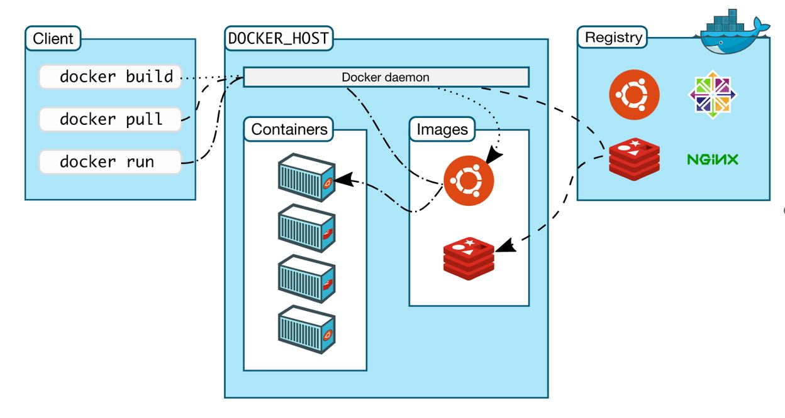
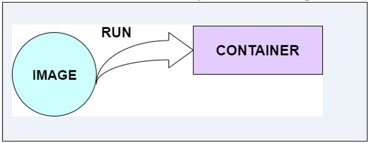
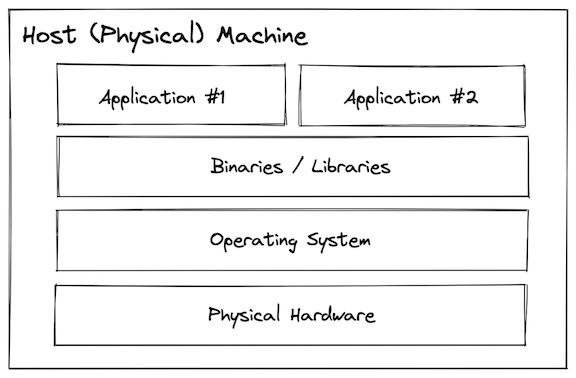
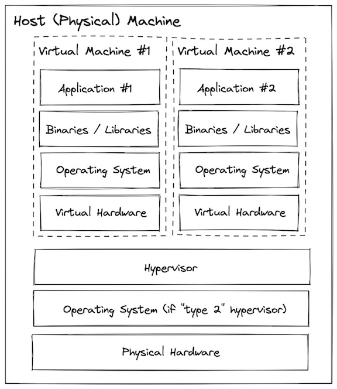
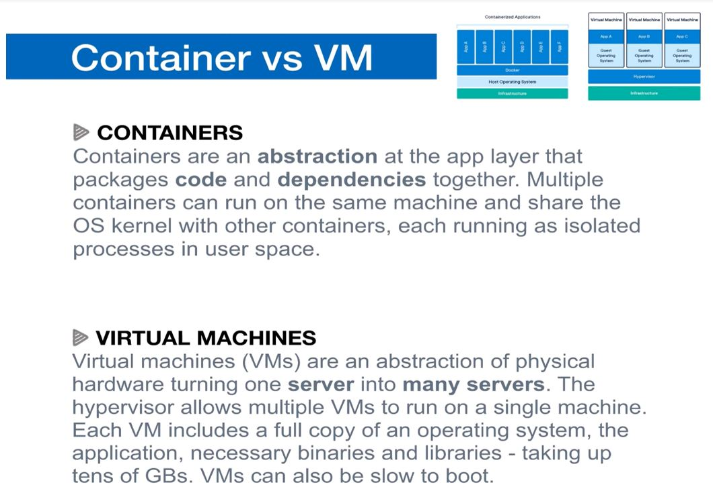
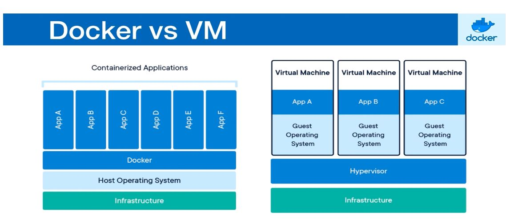

###################################################################################################
### Docker Step-by-Step Guide
### Creator – Pratik Kishor Munot
### Email id – pmunot11@gmail.com / pmunot@slb.com
### Version – 1.1
### Readme – This document is created by Pratik Munot for basic understanding of Docker Theory
### Last Updated – 31st May, 2023
##################################################################################################
```diff
- text in red
+ text in green
! text in orange
# text in gray
@@ text in purple (and bold)@@
```

<!-- no toc -->
  - [Docker Installation Steps on RHEL 7](#Docker-installation-Steps-on-RHEL-7)
  - [What is a container?](#what-is-a-container)
  - [History of virtualization](#history-of-virtualization)
    - [Bare Metal](#bare-metal)
    - [Virtual Machines](#virtual-machines)
    - [Containers](#containers)
    - [Tradeoffs](#tradeoffs)

---

### Docker installation Steps on RHEL 7
A way to package application with all the necessary dependencies and configuration
It’s a portable artifact that can be easily shared and moved around

1.	Login to RHEL Linux VM
2.	Type the following command to install Docker via yum provided by Red Hat:
sudo yum install docker
3.	Type the following command to remove old version of Docker:
sudo yum remove docker docker-common docker-selinux docker-engine
4.	Type the following command to install the latest version of Docker CE (community edition):
sudo yum-config-manager --add-repo https://download.docker.com/linux/centos/docker-ce.repo
5.	sudo yum install docker-ce
6.	Check the version of docker to verify the installation
docker –version
7.	Start docker daemon process by running cmd
systemctl start docker
8.	Run docker version cmd to check both client and server are running properly
9.  Once you are done installing Docker, test your Docker installation by running the following:
```
$ docker run hello-world

Hello from Docker.
This message shows that your installation appears to be working correctly.

```
src - https://www.cyberciti.biz/faq/install-use-setup-docker-on-rhel7-centos7-linux/


---------------------------------------------
### $\textcolor{green}{Docker}$


# Docker
```
Docker is a centralized platform for building, packaging, deploying, running and shipping applications. In simpler words, 
Docker is a tool that allows developers, sys-admins etc. to easily deploy their applications in a sandbox (called containers) 
to run on the host operating system i.e. Linux. The key benefit of Docker is that it allows users to package an application 
with all of its dependencies into a standardized unit for software development. 
Unlike virtual machines, containers do not have high overhead and hence enable more efficient usage of the underlying system and resources.Before Docker, 
many users face the problem that a particular code is running in the developer's system but not in the user's system. 
So, the main reason to develop docker is to help developers to develop applications easily, ship them into containers, and can be deployed anywhere.
Docker is written in Go programming language.
Advantages of Docker 
•	It runs the container in seconds instead of minutes.
•	It uses less memory.
•	It provides lightweight virtualization.
•	It does not a require full operating system to run applications.
•	It uses application dependencies to reduce the risk.
•	Docker allows you to use a remote repository to share your container with others.
•	It provides continuous deployment and testing environment.
Disadvantages of Docker
•	It increases complexity due to an additional layer.
•	In Docker, it is difficult to manage large amount of containers.
•	Some features such as container self -registration, containers self-inspects, copying files form host to the container, and more are missing in the Docker.
•	Docker is not a good solution for applications that require rich graphical interface.
•	Docker provides cross-platform compatibility means if an application is designed to run in a Docker container on Windows, then it can't run on Linux or vice versa.
```

---------------------------------------------
### Docker Terminologies in brief
Images
> The blueprints of our application which form the basis of containers. In the demo above, we used the docker pull command to download the busybox image.

Containers  
> Created from Docker images and run the actual application. We create a container using docker run which we did using the busybox image that we downloaded. A list of running containers can be seen using the docker ps command.

Docker Daemon
> The background service running on the host that manages building, running and distributing Docker containers. The daemon is the process that runs in the operating system which clients talk to.

Docker Hub
> A registry of Docker images. You can think of the registry as a directory of all available Docker images. If required, one can host their own Docker registries and can use them for pulling images.


# Docker Architecture



Docker follows Client-Server architecture, which includes the three main components that are Docker Client, Docker Host, and Docker Registry.

### 1.	Docker Client
> The command line tool that allows the user to interact with the daemon. More generally, there can be other forms of clients too - such as Kitematic which provide a GUI to the users. Docker client uses commands and REST APIs to communicate with the Docker Daemon (Server). When a client runs any docker command on the docker client terminal, the client terminal sends these docker commands to the Docker daemon. Docker daemon receives these commands from the docker client in the form of command and REST API's request. The Docker client can communicate with more than one daemon.
Docker Client uses Command Line Interface (CLI) to run the following commands -
•	docker build
•	docker pull
•	docker run

### 2.	Docker Host
Docker Host is used to provide an environment to execute and run applications. Docker Daemon is a service that runs on your host operating system. It is responsible for running containers to manage docker services. Docker daemon communicates with other daemons. It offers various Docker objects such as images, containers, networking, and storage. A daemon can also communicate with other daemons to manage Docker services.

### 3.	Docker Registry
Docker Registry manages and stores the Docker images.
There are two types of registries in the Docker -
Pubic Registry - Public Registry is also called as Docker hub.
Private Registry - It is used to share images within the enterprise.

---------------------------------------------
### Docker workflow
As a user we can only talk to Docker client via CLI. If we want any information or want to perform any task then we need to talk to docker client first, then docker client talks to docker Daemon ie docker server/host to get that task done

When we run a command – docker run hello-world on docker client via CLI, we are asking docker client to run that image through container. Docker client then talks to Docker server to run the image. Docker server tries to find the image in cache, but it is unable to find it so now Docker Server talks to Docker Registry to get/download that image from registry.  

---------------------------------------------
## Docker Objects

There are the following Docker Objects -

### Docker Images
Docker images are the read-only binary templates used to create Docker Containers. It uses a private container registry to share container images within the enterprise and also uses public container registry to share container images within the whole world. Metadata is also used by docket images to describe the container's abilities.

### Docker Containers


Containers are the structural units of Docker, which is used to hold the entire package that is needed to run the application. The advantage of containers is that it requires very less resources.
In other words, we can say that the image is a template, and the container is a copy of that template.
 
### Docker Networking
Using Docker Networking, an isolated package can be communicated. Docker contains the following network drivers -
Bridge - Bridge is a default network driver for the container. It is used when multiple docker communicates with the same docker host.
Host - It is used when we don't need for network isolation between the container and the host.
None - It disables all the networking.
Overlay - Overlay offers Swarm services to communicate with each other. It enables containers to run on the different docker host.
Macvlan - Macvlan is used when we want to assign MAC addresses to the containers.

### Docker Storage
Docker Storage is used to store data on the container. Docker offers the following options for the Storage -
Data Volume - Data Volume provides the ability to create persistence storage. It also allows us to name volumes, list volumes, and containers associates with the volumes.
Directory Mounts - It is one of the best options for docker storage. It mounts a host's directory into a container.
Storage Plugins - It provides an ability to connect to external storage platforms.

---------------------------------------------
### What is an Image
An image is a read-only template with instructions for creating a Docker container (ie. an environment of your own choice). A docker image is described in text file called a Dockerfile, which has a simple, well-defined syntax. An image does not have states and never changes. Docker Engine provides the core Docker technology that enables images and containers.
To build your own image, you create a Dockerfile with a simple syntax for defining the steps needed to create the image and run it. Each instruction in a Dockerfile creates a layer in the image. When you change the Dockerfile and rebuild the image, only those layers which have changed are rebuilt. This is part of what makes images so lightweight, small, and fast, when compared to other virtualization technologies.
An image can also be considered a snapshot of your current working environment.

---------------------------------------------
### Docker Container
A Docker container image is a lightweight, standalone, executable package of software that includes everything needed 
to run an application (https://www.docker.com/resources/what-container/).Docker container is a running instance of an image. 
You can use Command Line Interface (CLI) commands to run, start, stop, move, or delete a container. 
You can also provide configuration for the network and environment variables. You can connect a container to one or more 
networks, attach storage to it, or even create a new image based on its current state. Docker containers are the lightweight 
alternatives of the virtual machine. It allows developers to package up the application with all its libraries, dependencies, 
and configurations, and ship it as a single package. The advantage of using a docker container is that you don't need to 
allocate any RAM and disk space for the applications. It automatically generates storage and space according to the application requirement. 
It’s a portable artifact that can be easily shared and moved around A container is an isolated environment for running an application

Container is basically layers of stacked images on top of each other and at the base of most containers we would have 
Linux based image which can be alpine with linux distro or some other specific version. Containers are an abstraction at app 
layer that packages code and dependencies together. So on top of base image we can have application layer along with some other necessary middle layers in between

Container is a special kind of process running on computer. A VM contains complete OS but A container does not contain full 
blown entire OS, instead all containers on host share OS of host to be precise they share kernel of host(A kernel manages applications as well as hardware resources)

On linux machine we can only build and run linux containers whereas on new windows 10 machine we can use both windows 
as well as linux containers. This is because new windows 10 os is build with custom linux kernal

---------------------------------------------
## History of virtualization

### Bare Metal

Before virtualization was invented, all programs ran directly on the host system. The terminology many people use for this is "bare metal".  



With a bare metal system, the operating system, binaries/libraries, and applications are installed and run directly onto the physical hardware.

This is simple to understand and direct access to the hardware can be useful for specific configuration, but can lead to:
- Hellish dependency conflicts
- Low utilization efficiency
- Large blast radius
- Slow start up & shut down speed (minutes)
- Very slow provisioning & decommissioning (hours to days)

---------------------------------------------

### Virtual Machines

Virtual machines use a system called a "hypervisor" that can carve up the host resources into multiple isolated virtual hardware configuration which you can then treat as their own systems (each with an OS, binaries/libraries, and applications).



This helps improve upon some of the challenges presented by bare metal:

- No dependency conflicts
- Better utilization efficiency
- Small blast radius
- Faster startup and shutdown (minutes)
- Faster provisioning & decommissioning (minutes)

---------------------------------------------

### Containers

Containers are similar to virtual machines in that they provide an isolated environment for installing and configuring binaries/libraries, but rather than virtualizing at the hardware layer containers use native linux features (cgroups + namespaces) to provide that isolation while still sharing the same kernel.


This approach results in containers being more "lightweight" than virtual machines, but not providing the save level of isolation:

- No dependency conflicts
- Even better utilization efficiency
- Small blast radius
- Even faster startup and shutdown (seconds)
- Even faster provisioning & decommissioning (seconds)
- Lightweight enough to use in development!

---------------------------------------------
### Containers VS Virtual Machines

A container is an isolated environment for running an application. Whereas a VM is an abstraction of a physical machine. Major problem with VM is that each VM needs a full copy of OS which makes it slow to start.

Containers are running multiple apps in isolation. Containers use host OS which makes them very lightweight. Containers can start very quickly and use very less hardware resources.




### Docker VS Virtual Machines



